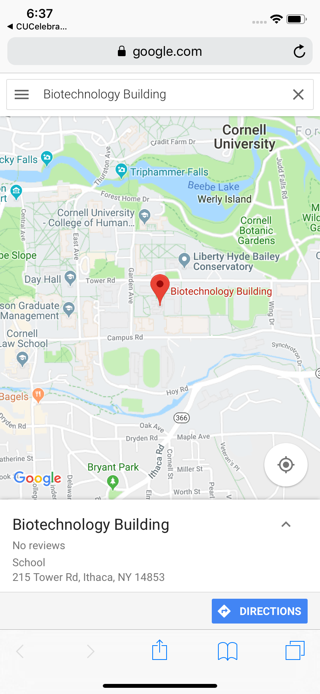

# Cornell AppDev Hack Challenge: CUCelebrate!

An app that consolidates events happening on Cornell's Campus.

Link to Backend Repo

https://github.com/pihucode/cucelebrate-backend

Screenshots

The sheer size of Cornell's campus definitely facilitates a variety of events to go to - if you can find them. Since so many events are available, it's often difficult to know what's happening on any given day. CUCelebrate is the solution to this problem, allowing anyone to know exactly what's going on at Cornell - let's CUCelebrate!

